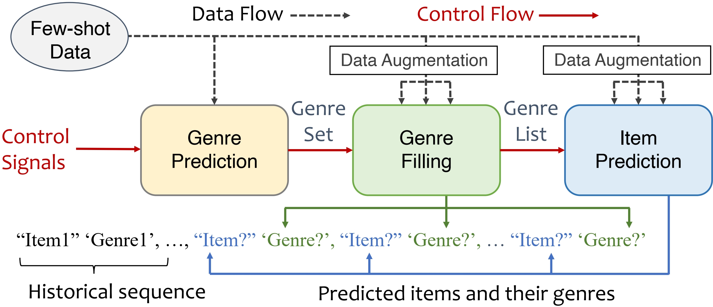

# DLCRec

This is the code for DLCRec (DLCRec: A Novel Approach for Managing Diversity in LLM-Based Recommender Systems) for [WSDM 2025](https://www.wsdm-conference.org/2025/), a novel framework enables LLMs to output recommendations with varying user requests for diversity.



## Data
We experiment on two real-world datasets, [MovieLens-10M](https://grouplens.org/datasets/movielens/10m/) and [Steam](https://github.com/kang205/SASRec). 

For Movie, download and unpack the data and put 'ratings.dat' and 'movies.dat' into the directory "./data/movie_sgcate". Then run the jupyter notebook 'precess.ipynb' in "./data/movie_sgcate" to generate task-specific data and the augmented data. 

For Steam, download and unpack the data and put 'steam_games.json' and 'steam_new.json' into the directory "./data/steam_sgcate". Then run the jupyter notebook 'preprocess.ipynb' and 'process.ipynb' in "./data/steam_sgcate" to generate task-specific data and the augmented data. 

Please also download the backbone LLM. In this work, we use [Meta-Llama-3-8B-Instruct](https://huggingface.co/meta-llama/Meta-Llama-3-8B-Instruct). Please put the directory of it next to that of DLCRec.

## Environment

We create our environment based on [Llama Factory](https://github.com/hiyouga/LLaMA-Factory). You can use the following code to create a conda environment:

```
conda env create -f llama_factory.yaml
```


## Training framework

DLCRec decompose the diversity-oriented controllable recommendation into 3 specific sub-tasks: genre predicting (GP), genre filling (GF) and item predicting (IP). Let us take the Movie dataset for example.

before running each task, please kindly assign the GPU number in the code file!

To generate the embeddings of items for Grounding, run
```
python ./data/movie_sgcate/generate_embedding.py
```

To train each model, select the training and validation set and run
```
bash ./train.sh
```

To infer each model, replace {ModelName} with the model directory and run
```
python inference.py --test_data_path ./data/movie_sgcate/test_1000_GP.json --base_model ../Meta-Llama-3-8B-Instruct/ --lora_weights ./model/movie_sgcate/{ModelName} --result_json_data ./movie_sgcate_result/{ModelName}_GP1000gred.json --batch_size 64
```
```
python inference.py --test_data_path ./data/movie_sgcate/test_1000_BERT_GF.json --base_model ../Meta-Llama-3-8B-Instruct/ --lora_weights ./model/movie_sgcate/{ModelName} --result_json_data ./movie_sgcate_result/{ModelName}_GF1000gred.json --batch_size 64
```
```
python inference.py --test_data_path ./data/movie_sgcate/test_1000_BERT_IP.json --base_model ../Meta-Llama-3-8B-Instruct/ --lora_weights ./model/movie_sgcate/{ModelName} --result_json_data ./movie_sgcate_result/{ModelName}_IP1000gred.json --batch_size 16
```

To evaluate each model, run
```
python ./data/movie_sgcate/evaluate_GP.py
```
```
python ./data/movie_sgcate/evaluate_GF.py
```
```
python ./data/movie_sgcate/evaluate_IP.py
```
## Control framework
The user can select the control number of genres as they wish, and DLCRec propagate the control signals through 3 sub-tasks to form the final recommendation. We do the following steps to operate the control framework:
+ First, we infer the model of task GP to get the predicted genres given the control number (which, for example, is 5 here). Please first replace {GPModelName} with the GP model directory.
    ```
    python inference_controlGPnum.py --test_data_path ./data/movie_sgcate/test_1000_GP.json --base_model ../Meta-Llama-3-8B-Instruct/ --lora_weights ./model/movie_sgcate/{GPModelName}  --result_json_data ./movie_sgcate_result/{GPModelName}_5GP1000gred.json --batch_size 64 --control_GPnum 5
    ```
+ Second, we transfer format of task GP's output into the format of task GF's input. We put the result file path into the file "./data/movie_sgcate/modifyGF_controlGP.py" and then run:
    ```
    python ./data/movie_sgcate/modifyGF_controlGP.py
    ```
    witch put the control target into the file "./data/movie_sgcate/test_1000_BERT_GF_controlGP.json".

+ Third, we infer the model of task GF to get the genres of future items given the control target by task GP. We put the control number 5 in the file path to facilitate evaluation. Please replace {GFModelName} with the GF model directory, and replace {ControlTarget} with key value in "./data/movie_sgcate/test_1000_BERT_GF_controlGP.json".
    ```
    python inference_controlGP.py --test_data_path ./data/movie_sgcate/test_1000_BERT_GF_controlGP.json --base_model ../Meta-Llama-3-8B-Instruct/ --lora_weights ./model/movie_sgcate/{GFModelName}  --result_json_data ./movie_sgcate_result/{GFModelName}_control{ControlTarget}_5GF1000gred.json --batch_size 64 --control_GP {ControlTarget}
    ```
+ Fourth, we transform format of task GF's output into the format of task IP's input. We put the result file path into the file "./data/movie_sgcate/modifyIP_controlGF.py" and then run:
    ```
    python ./data/movie_sgcate/modifyIP_controlGF.py
    ```
    witch put the control target into the file "./data/movie_sgcate/test_1000_BERT_IP_controlGF.json".

+ Finally, we infer the model of task IP to get the future genres given the control target by task GF. We put the control number 5 in the file path to facilitate evaluation. Please replace {IPModelName} with the IP model directory, and replace {ControlTarget} with key value in "./data/movie_sgcate/test_1000_BERT_IP_controlGF.json".
    ```
    python inference_controlGF.py --test_data_path ./data/movie_sgcate/test_1000_BERT_IP_controlGF.json --base_model ../Meta-Llama-3-8B-Instruct/ --lora_weights ./model/movie_sgcate/{IPModelName}  --result_json_data ./movie_sgcate_result/{IPModelName}_control{ControlTarget}_5GF1000gred_IP1000gred.json --batch_size 16 --control_GF {ControlTarget}
    ```
In this case, we infer the three sub-tasks step by step to get the final user-specific recommendation lists. The naming convention here is intended to more clearly show the relationship between the model and the previous control signal information. You are certainly free to use other naming conventions.

To evaluate each model, also run
```
python ./data/movie_sgcate/evaluate_GP.py
```
```
python ./data/movie_sgcate/evaluate_GF.py
```
```
python ./data/movie_sgcate/evaluate_IP.py
```

## Other baselines：
For BIGRec or BIGRec_CoT or BIGRec_div, the training and infering process are similar as above. To evaluate it, run
```
python ./data/movie_sgcate/evaluate_BIGRec.py
```
For Raw LLM, given to their unstable output format, evaluate it by running:
```
python ./data/movie_sgcate/evaluate_RAW.py
```
